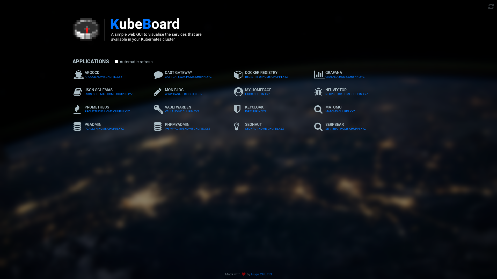

<!-- markdownlint-disable MD033 MD041 -->

# KubeBoard

A simple web GUI for visualizing the services that are available in a _Kubernetes_ cluster. Written in Python using the [Flask framework](https://flask.palletsprojects.com/en/stable/), it allows you to automatically populate a custom homepage/dashboard based on all the ingresses you've created. Basic customization is also implemented, such as the icon and/or title of each deployed application, and even the theme of the dashboard. Automatic and periodic updating of applications is implemented to make presentations more dynamic.



<p align="right">(<a href="#kubeboard">back to top</a>)</p>

## Customize applications

By default, **KubeBoard** displays all `̀Ingress` using their `.metadata.name` attribute and a default icon. If you want to customize the name and/or the icon of a specific `Ingress` or even remove it from the homepage, you can use the following annotations:

| Annotation | Default value | Description |
|---|---|---|
| **kubeboard.xyz/show** | `true` | Whether or not to display the `Ingress` within **KubeBoard** homepage |
| **kubeboard.xyz/name** | `<.metadata.name>` | The name of the application |
| **kubeboard.xyz/icon** | `fa-external-link` | The icon of the application |

We are currently using the **[ForkAwesome](https://forkaweso.me/Fork-Awesome/)** icon library. You can [find all available icons](https://forkaweso.me/Fork-Awesome/icons/) in its documentation.

<p align="right">(<a href="#kubeboard">back to top</a>)</p>

## Customize theme

To facilitate the integration of **KubeBoard** in any project, some theming elements can be customized. This is done by defining the following available environment variables:

| Environment variable | Default value | Description |
|---|---|---|
| **FLASK_THEME_PRIMARY_COLOR** | `#0075ff` | The primary color (CSS `rgb()`, `rgba()`, `#hex`) |
| **FLASK_THEME_SECONDARY_COLOR** | `#AABBC3` | The secondary color (CSS `rgb()`, `rgba()`, `#hex`) |
| **FLASK_THEME_BACKGROUND_URL** | `../img/earth-background.jpg` | The background image to use (CSS relative path or URL) |

<p align="right">(<a href="#kubeboard">back to top</a>)</p>

## Getting started (Helm)

**KubeBoard** is designed to run inside a _Kubernetes_ cluster. To make it easier to deploy, we maintain a special _Helm_ chart, which you can find in the `chart` folder.

Like any other _Helm_ chart, the available configuration options can be found in the `chart/values.yaml` configuration file. We recommend you to override any values in a dedicated `kubeboard.values.yaml` file before deploying the chart:

```bash
cp chart/values.yaml kubeboard.values.yaml
vim kubeboard.values.yaml
```

You can set any of the previously referenced environment variables mentioned above by setting them in the `.env` attribute of the `kubeboard.values.yaml` before deploying the chart:

```yaml
# kubeboard.values.yaml
env:
  FLASK_APP_HIDE_BY_DEFAULT: "false"
  FLASK_THEME_PRIMARY_COLOR: "#0075ff"
  FLASK_THEME_SECONDARY_COLOR: "#AABBC3"
  FLASK_THEME_BACKGROUND_URL: "../img/earth-background.jpg"
```

Finally, use the following command to deploy the chart:

```bash
helm upgrade --install -n <namespace> -f kubeboard.values.yaml kubeboard ./chart
```

<p align="right">(<a href="#kubeboard">back to top</a>)</p>

## Getting started (Docker)

To run **KubeBoard** locally, we recommend using _[Docker](https://www.docker.com/)_ or _[Podman](https://podman.io/)_. Note that you'll also need a valid and accessible _Kubernetes_ cluster, as you'll need to mount your local `kubeconfig` file in the appropriate container directory:

```bash
docker run -v $HOME/.kube:/app/.kube -p 5000:5000 ghcr.io/bythehugo/kubeboard:1.0.1
```

You can set any of the previously referenced environment variables mentioned above by using the `-e`/`--env` option:

```bash
docker run -v $HOME/.kube:/app/.kube -e FLASK_APP_HIDE_BY_DEFAULT="true" -p 5000:5000 ghcr.io/bythehugo/kubeboard:1.0.1
```

<p align="right">(<a href="#kubeboard">back to top</a>)</p>

## Getting started (local)

In order to get a local copy up and running, you'll need to follow these simple steps.

### Prerequisites

- At least `Python` v3.12 and its `pip` module:

    ```bash
    # Install the required packages on Debian-based systems
    sudo apt install python3 python3-pip

    # Validate installation
    python3 -V
    ```

### Installation

1. Clone the repo:

    ```bash
    git clone https://github.com/ByTheHugo/kubeboard.git
    ```

2. Install the Python packages using `pip`:

    ```bash
    python3 -m pip install -r requirements.txt
    ```

3. Customize environment variables by editing the `.flaskenv` file _(if needed)_

4. Run the application:

    ```bash
    python3 -m flask run
    ```

<p align="right">(<a href="#kubeboard">back to top</a>)</p>

## License

Distributed under the Apache 2.0 License. See `LICENSE` for more information.

<p align="right">(<a href="#kubeboard">back to top</a>)</p>

## Contact

Hugo CHUPIN - [@hugo.chupin.xyz](https://bsky.app/profile/hugo.chupin.xyz) - <hugo@chupin.xyz>

Project link: [https://github.com/ByTheHugo/kubeboard](https://github.com/ByTheHugo/kubeboard)

<p align="right">(<a href="#kubeboard">back to top</a>)</p>
